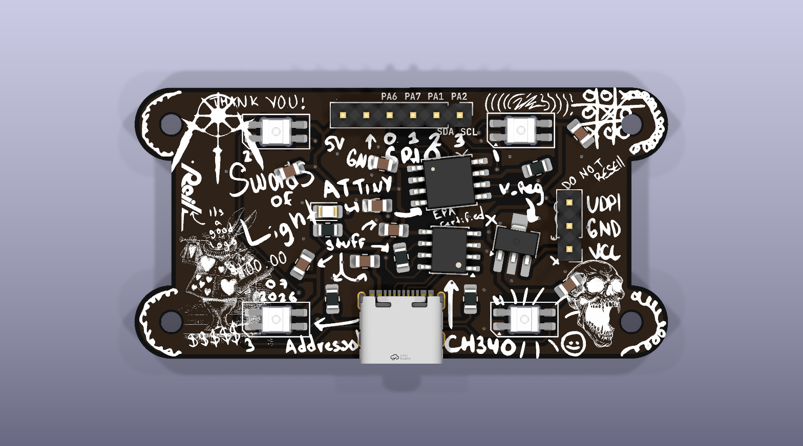

# Cursed PCB

Cursed PCB is a programmable light board with an ATtiny412 microcontroller, four individually addressable RGB LEDs, onboard USB-C power, and an onboard CH340 SerialUPDI programmer. Plug it into a computer, install the ATtiny board support in Arduino IDE, and upload your own light patterns.



> **Quick links:** [LED example](examples/LED_example/LED_example.ino) · [printable quick-start guide](docs/cursed-pcb-quick-start.pdf) · [3 × 5 setup card](docs/cursed-pcb-setup-card-3x5.pdf) · [megaTinyCore documentation](https://github.com/SpenceKonde/megaTinyCore)

## Repository contents

- [`examples/LED_example/LED_example.ino`](examples/LED_example/LED_example.ino) — ready-to-upload LED animations and optional button support
- [`docs/cursed-pcb-quick-start.pdf`](docs/cursed-pcb-quick-start.pdf) — printable two-page quick-start guide
- [`docs/cursed-pcb-setup-card-3x5.pdf`](docs/cursed-pcb-setup-card-3x5.pdf) — single-sided, low-ink 3 × 5 inch setup card
- [`attiny412_addressable.kicad_sch`](attiny412_addressable.kicad_sch) — KiCad schematic
- [`attiny412_addressable.kicad_pcb`](attiny412_addressable.kicad_pcb) — KiCad PCB layout
- [`attiny412_addressable.kicad_pro`](attiny412_addressable.kicad_pro) — KiCad project settings

## What you need

- The Cursed PCB
- A USB-C **data** cable (some charging-only cables cannot upload code)
- [Arduino IDE](https://www.arduino.cc/en/software)
- The `LED_example` sketch in this repository

No separate LED library download is required. The `tinyNeoPixel_Static` library used by the example is included with megaTinyCore.

## 1. Install ATtiny412 support

The ATtiny412 is not included in Arduino IDE by default. Install the **megaTinyCore** board package:

1. Open Arduino IDE.
2. Open **File → Preferences**. On macOS, open **Arduino IDE → Settings**.
3. Add this URL to **Additional Boards Manager URLs**:

   ```text
   http://drazzy.com/package_drazzy.com_index.json
   ```

   If another URL is already present, use the button beside the field and add this URL on a new line.

4. Open **Tools → Board → Boards Manager**.
5. Search for `megaTinyCore`.
6. Install the newest version of **megaTinyCore by Spence Konde**.

The package includes the compiler, upload utility, and `tinyNeoPixel` libraries needed by this board.

## 2. Connect and configure the board

Connect the board directly to the computer with a USB-C data cable. The power LED should turn on and a new serial port should appear in Arduino IDE.

Select these settings under **Tools**:

| Setting | Selection |
| --- | --- |
| Board | **megaTinyCore → ATtiny412/402/212/202** |
| Clock | **20 MHz internal** |
| BOD Voltage Level | **4.2V (20 MHz or less)** |
| millis()/micros() Timer | **Enabled (default timer)** |
| Programmer | **SerialUPDI - 230400 baud** |

Choose the board entry **without** “w/Optiboot.” This board programs the ATtiny412 directly over UPDI and does not need a bootloader.

The onboard CH340 connection is dedicated to UPDI programming. It is not connected to the ATtiny412's normal UART pins, so Arduino Serial Monitor will not display `Serial.print()` output through this USB-C connection. PA6/TX and PA7/RX remain available on the six-pin header for an external serial adapter.

## 3. Open and upload the example

1. Download or clone this repository.
2. Open [`examples/LED_example/LED_example.ino`](examples/LED_example/LED_example.ino) in Arduino IDE.
3. Compile with **Sketch → Verify/Compile**.
4. Upload with **Sketch → Upload Using Programmer**. The regular Upload button is not used for this UPDI setup.

After the upload finishes, the four LEDs run through red, green, blue, white, a rainbow sweep, and a moving white chase.

### Optional mode button

The example supports an optional normally-open pushbutton connected between exposed pins **0 (PA6)** and **2 (PA1)**. No external resistor is needed for this example: the sketch drives PA6 low and enables PA1's internal pull-up. Each press advances to the next animation.

If no button is connected, the example still works. It automatically shows the four solid colors and then continues with the rainbow sweep.

## Programming the lights

The four onboard LEDs are SK6812MINI-E addressable RGB LEDs connected as one chain. The first LED's data input is connected to **PA3**, which megaTinyCore calls Arduino pin **4**.

The important setup from the example is:

```cpp
#include <tinyNeoPixel_Static.h>

constexpr uint8_t LED_PIN = PIN_PA3;  // Arduino pin 4
constexpr uint8_t NUM_LEDS = 4;

byte pixelData[NUM_LEDS * 3];
tinyNeoPixel leds(NUM_LEDS, LED_PIN, NEO_GRB, pixelData);

void setup() {
  pinMode(LED_PIN, OUTPUT);
  leds.setBrightness(20);              // 0 to 255
  leds.setPixelColor(0, 255, 0, 0);   // first LED: red
  leds.show();
}
```

`tinyNeoPixel_Static` keeps the LED buffer in a fixed array, which is helpful on the ATtiny412's limited memory. Set colors with `setPixelColor()`, then call `show()` to send the updated buffer to the LEDs. The LEDs use `NEO_GRB` byte order.

Keep the brightness modest while experimenting. Four LEDs at full white use much more current and can be uncomfortably bright.

## Pinout

With the component side facing up and the USB-C connector at the bottom, the six-pin header reads left to right:

| Header label | Arduino pin | ATtiny412 pin | Common functions |
| --- | ---: | --- | --- |
| 5V | — | VDD | Regulated 5 V rail |
| GND | — | GND | Ground |
| 0 | 0 | PA6 | Digital I/O, DAC, UART TX |
| 1 | 1 | PA7 | Digital I/O, UART RX |
| 2 | 2 | PA1 | Digital I/O, I²C SDA |
| 3 | 3 | PA2 | Digital I/O, I²C SCL |

Arduino pin **4 / PA3** controls the onboard LEDs and is not on the six-pin header. **PA0 / UPDI** is reserved for programming.

The separate three-pin header is labeled **UPDI, GND, VCC** from top to bottom when the USB-C connector is at the bottom. It is intended for advanced external programming and power setups; it is not needed for normal USB-C programming.

## Power and handling

- For normal use, power and program the board through USB-C.
- The exposed **5V** pin is connected to the board's 5 V rail. Do not feed power into it while USB-C is connected, and never apply more than regulated 5 V to it.
- Do not connect an external supply to the three-pin header's **VCC** pin while USB-C is connected.
- The board has exposed electronics. Prevent metal objects, conductive surfaces, and loose wires from shorting it.
- Disconnect power before changing wiring. Observe polarity when using external power.
- The LEDs can be very bright. Avoid staring directly at them at high brightness.

## Troubleshooting

### No serial port appears

- Try a known USB-C data cable and another USB port.
- Disconnect and reconnect the board while watching **Tools → Port**.
- If the computer does not recognize the onboard CH340 USB serial device, install the CH340 driver for your operating system.

### Upload fails or reports “UPDI initialization failed”

- Confirm **ATtiny412/402/212/202** (without Optiboot), **BOD Voltage Level → 4.2V**, and **SerialUPDI - 230400 baud** are selected.
- Use **Sketch → Upload Using Programmer**, not the regular Upload command.
- Close any serial monitor or other application using the board's port.
- Try **SerialUPDI - SLOW: 57600 baud** under **Tools → Programmer**.
- Unplug the board, reconnect it, reselect the port, and try again.

### The sketch uploads but the LEDs stay dark

- Confirm the sketch uses four pixels, `NEO_GRB`, and LED pin `PIN_PA3` or Arduino pin `4`.
- Make sure the LED data pin is configured as `OUTPUT` when using `tinyNeoPixel_Static`.
- Increase `setBrightness(20)` slightly while testing, but do not start at full brightness.

### The sketch is too large

The ATtiny412 has 4 KB of program flash and 256 bytes of SRAM. Prefer `tinyNeoPixel_Static`, avoid large strings and unnecessary libraries, and keep the pixel buffer at `4 × 3 = 12` bytes.

## Hardware summary

- ATtiny412, 4 KB flash / 256 bytes SRAM
- Four SK6812MINI-E addressable RGB LEDs
- USB-C connector with onboard CH340 SerialUPDI programming
- Four exposed GPIO pins, including I²C SDA/SCL
- Approximately 58 mm × 29.5 mm
- Four 2.2 mm mounting holes

For deeper ATtiny and library information, see the official [megaTinyCore installation guide](https://github.com/SpenceKonde/megaTinyCore/blob/master/Installation.md), [megaTinyCore reference](https://github.com/SpenceKonde/megaTinyCore), and [tinyNeoPixel reference](https://github.com/SpenceKonde/megaTinyCore/blob/master/megaavr/extras/tinyNeoPixel.md).
